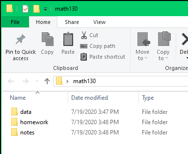

# Learning Objectives

After completing this lesson learners will be able to:

* Use R and R Studio on their personal computer. 
* Describe the purpose of the RStudio Script, Console, Environment, and Plots panes.
* Organize files and directories for a set of analyses as an R Project, and understand the purpose of the working directory.
* Execute simple commands in the console
* Use the built-in RStudio help interface to search for more information on R functions.
* Demonstrate how to provide sufficient information for troubleshooting with the R user community.

## Icon Definitions
* `r emo::ji("pencil2")` Forward arrow: Task for you to do
* `r emo::ji("arrow_down_small")` Down arrow: A download link is present. 
* `r emo::ji("x")` Red X: Something you should NOT do
* `r emo::ji("warning")` Warning triangle: this is something you should be aware of or pay attention to. 

---

# `r emo::ji("warning")` A note about R and RStudio:

If you are using a tablet, Chromebook or otherwise do not have a computer that you can install programs on, you can use Posit Cloud for this class. 

* Make a **Cloud FREE** account at https://posit.cloud/plans/free
* Start a new project by clicking on the button in the top right corner
* Then go to [slide #6](#intro_rstudio) to learn how to navigate RStudio. 

The free account allows for 25 project hours/month, which may not be enough for this class. If you run into time limits or you are using this for another class you will have to upgrade to the **Cloud Student** plan which is $5/month. 

Using the cloud is easier to initially setup, but having your own installation on your computer ensures that

* you want to keep the program free forever
* you will be able to put your files under version control
* you always have access to your code even with unstable or no internet

---
background-image: url('../static/img/R.png')
background-position: top right
background-size: 180px 150px

# Download and install R 

## `r emo::ji("arrow_down_small")` Download R v 4.5+
* Windows 10 https://cran.r-project.org/bin/windows/base/ 
* Mac OS X page - https://cran.r-project.org/bin/macosx/ 
  - First link under "Latest Release" and looks like **R-4.5.0.pkg**. 
  - `r emo::ji("warning")` You may later get a message about needing *X11* or *XQuartz*. The download for that program is also on this page. (Mac only)
* Choose to save the file, do not open or run. 
    
## `r emo::ji("pencil2")` Install
* Install R by double clicking on the downloaded file and following the prompts.
  - Default settings are OK. 
  - Delete any desktop shortcuts that was created (looks like the icon above.)


## `r emo::ji("cinema")` Video Tutorials for both R and R Studio. 
* [Windows](https://youtu.be/KAeHFzxbHTA?si=xpeDGqt7gurg_rFR)
* [Mac](https://youtu.be/ay25o485YXs?si=7r4qmmvtD15RM_eS)


---
background-image: url('../static/img/RStudio.png')
background-position: top right
background-size: 180px 150px
 
# Download and install R Studio

## `r emo::ji("arrow_down_small")` Download the most recent version from
* [https://posit.co/download/rstudio-desktop/](https://posit.co/download/rstudio-desktop/) 
* Your operating system should be automatically detected. If not, scroll down and choose your version.

## `r emo::ji("pencil2")` Install
* Windows: Double click on the downloaded file to run the installer program. 
* Mac: Double click on the downloaded file, then drag the R Studio Icon into your Applications folder.
  - After you are done, eject the "Drive" that you downloaded by dragging the icon to your trash. 

---
name: intro_rstudio

# Navigating R Studio

We will be interacting with the programming language R _only_ through R Studio. Not by itself. There are four panes, or windows, in R Studio. 

`r emo::ji("cinema")` Watch one of the following short videos to learn how to navigate R Studio.

* [R Girls on YouTube](https://youtu.be/vx4SPeNvols?si=1iSqsH1uNLFkB7yF&t=239)
* [Dr. D's overview](https://media.csuchico.edu/media/t/1_93i6jwy8)


---

# Setting preferences in R Studio

##  Retain sanity while troubleshooting 

* Open R Studio and go to the file menu go to _Tools_ then _Global Options_.
* Uncheck "Restore .RData into workspace at startup" 
* Where it says "Save workspace to .RData on exit:" Select "Never""
* Click apply then ok to close that window.
  
This will ensure that when you restart R you do not "carry forward" objects such as data sets that you were working on in a prior assignment. 

To effectively restart R, go to the file menu and click _Session_ , then "Restart R", or "Restart R and clear output". 

`r emo::ji("cinema")` [Link to video walk through](https://youtu.be/49u5xAYfrgk) 

---
class: inverse, middle, center

# Downloading class materials

---
# Setup your folder for success! `r emo::ji("cinema")`

Using a consistent folder structure across your projects will help keep things
organized, and will also make it easy to find/file things in the future. This
can be especially helpful when you have multiple projects. `r emo::ji("cinema")` [Windows video walk through.](https://youtu.be/ayar0LFRg0U)


.pull-left[
`r emo::ji("pencil2")` On your computer, in an easy to find place, create a new folder named `math130`. Then create three subfolders: `data`, `homework`, `notes`.  


]

.pull-right[
You also need to choose a naming convention for your class folder and stick with it. Recommended options are: 

* ALL CAPS (`MATH130`)  
* no caps (`math130`)
* snake_case (`math_130`) 
* CamelCase (`Math130`) 
]


---

# Adding files into your class folder

When you download a file, right click and "Save as" or "Save target as" and **actively choose** where to download this file.

`r emo::ji("x")` Do not let files live in your downloads folder. 

`r emo::ji("x")` Do not open any files from your browser window after downloading.


`r emo::ji("arrow_down_small")` Right click [[this link]](../hw/hw1.Rmd) to download and save Assignment 1 into your `homework` folder now.  

---
class: inverse, middle, center

# Programming with R

---

# Terminology

The basis of programming is that we write down instructions for the computer to
follow, and then we tell the computer to follow those instructions. 

We write, or *code*, instructions in R because it is a common language that both the computer and we can understand. 

We call the instructions *commands* and we tell the computer to follow the instructions by *executing* (also called *running*) those commands.

The **console** pane is the place where commands written in the R
language can be typed and executed immediately by the computer. It is also where
the results will be shown for commands that have been executed. 

You can type commands directly into the console and press <kbd>`Enter`</kbd> to execute those commands, but they will be forgotten when you close the session.

---
# Code appearance

In these notes, code is displayed like this: 

```{r}
2+2
```

where the output or result of the code is displayed with two pound signs (`##`)

---
# R is an overgrown calculator

`r emo::ji("pencil2")` In the console type the following code, then press `Enter`.

```{r}
2+2
```

Now try a more complicated equation. 

```{r, error=TRUE}
2 + 5*(8^3)- 3*log10)
```

Uh oh, we got an Error. Nothing to worry about, errors happen all the time. 


`r emo::ji("pencil2")` Put a open parenthesis `(` before `log10` to fix it and try again. 

---
# > R is waiting on you...

`r emo::ji("pencil2")` In the console type the following code, then press `Enter`.

```r
2 + 5*(8^3)- 3*log(10
```

Notice the console shows a `+` prompt. This means that you haven't finished entering a complete command. 

This is because you have not 'closed' a parenthesis or
quotation, i.e. you don't have the same number of left-parentheses as
right-parentheses, or the same number of opening and closing quotation marks.

When this happens, and you thought you finished typing your command, click
inside the console window and press `Esc`; this will cancel the incomplete
command and return you to the `>` prompt.

---
class: inverse, middle, center

# Packages

.footnote[[_Where the real money from the movie is made._](https://spaceballs.fandom.com/wiki/Spaceballs:_The%E2%80%A6)]

---

# All the fun functions are in packages

R is considered an **Open Source** software program. That means many (thousands) of people contribute to the software. They do this by writing commands (called functions) to make a particular analysis easier, or to make a graphic prettier.

When you download R, you get access to a lot of functions that we will use. However these other _user-written_ packages add so much good stuff that it really is the backbone of the customizability and functionality that makes R so powerful of a language. 

For example we will be creating graphics using functions like `boxplot()` and `hist()` that exist in base R. But we will quickly move on to creating graphics using functions contained in the `ggplot2` package. We will be managing data using functions in `dplyr` and reading in Excel files using `readxl`. Installing packages will become your favorite past-time. 


---

# Installing Packages

`r emo::ji("pencil2")`  Start by typing the following in the console to install the `ggplot2` package. 

```r
install.packages("ggplot2")
```

When the download and install is complete, you should see a message simliar to: 

```r
The downloaded binary packages are in
	C:\Users\Robin\AppData\Local\Temp\Rtmpi8NAym\downloaded_packages
```


`r emo::ji("warning")` R is case sensitive and spelling matters. If you get an error message like the following: 

```r
Warning in install.packages :
  package ‘ggplot’ is not available (for R version 3.5.1)
```

The correct package name is `ggplot2`, not `ggplot`.

<br> 

**Alternative Method of installing Packages:**  
Use the Package tab in the lower right pane in R Studio. 

---
background-image: url('../static/img/allthethings.jpg')
background-position: 100% 50% 
background-size: 450px 400px

# Install all the things!

Now that you're a package installing pro, go ahead and install the following packages that we will be using in the next few weeks. 

<br> 

.pull-left[
`r emo::ji("pencil2")` Install the list of packages to the left one at a time and wait for it to finish before entering the next command.

* `tidyverse`
* `rmarkdown`
* `openintro`
* `tinytex`

]


---

# One more thing..


To write fancy math in your homework, or to turn your work into a nice looking PDF, you need a typesetting program called $\LaTeX$ (pronounced "lay-tek" or "lah-tex"). It's a super neat program, but also nearly 4Gb. Too big for our needs. That's where the `tinytex` package came from. we're going to use it to install a lightweight version of $\LaTeX$. This will let us write math equations in R Markdown, and create PDF's of your homework.

In your console type the following and hit **Enter**

```r
tinytex::install_tinytex()
```

This may take a few minutes, but then you're good to go!

---
class: inverse, top, center
background-image: url('https://bcgov.github.io/ds-cop-intro-to-r/fig/help-me-help-you.png')
background-position: 50% 75%
background-size: 45%

# Seeking Help

_Sometimes a second pair of eyeballs is all you need_

<center></center>

_Much of this information is also on the [FAQ](../faq.html) page_

.footnote[[Image credit: Intro to DS using R Workshop](https://bcgov.github.io/ds-cop-intro-to-r/seeking-help-from-others-with-reprex.html)]

---
# Advice on asking for help

The key to receiving help from someone is for them to rapidly grasp your problem. You should make it as easy as possible to pinpoint where the issue might be.

Try to use the correct words to describe your problem. For instance, a package is not the same thing as a library. Most people will understand what you meant, but it can make things confusing for people trying to help you. Be as precise as possible when describing your problem.

`r emo::ji("warning")` Don't let not knowing exactly how to describe your problem prevent you from asking. Screenshots help tremendously!

**When asking someone for help try to**
1. Explain what thing you are trying to do
2. Explain/show the code you wrote to try to do that thing
3. Explain/show your result, and if it's not obvious explain why you feel it's not the correct result. (E.g. you expected the answer to be 5, but instead it's 10. )

`r emo::ji("warning")` Don't spend more than 20 minutes banging your head on the wall before you ask for help!

---

# Help from inside R Studio

## Use the built-in RStudio help interface to search for more information on R functions

One of the fastest ways to get help is to use the RStudio help interface. This panel by default can be found at the lower right hand panel of RStudio. As seen in the screenshot, by typing the word `mean`, RStudio tries to also give a number of suggestions that you might be interested in. The description is then shown in the display window.

### I know the name of the function I want to use, but I'm not sure how to use it

If you need help with a specific function, let's say `barplot()`, you can type:

```{r, eval=FALSE, purl=FALSE}
?barplot
```

If you just need to remind yourself of the names of the arguments, you can use:

```{r, eval=FALSE, purl=FALSE}
args(lm)
```

---
# Help from inside R Studio cont.

### I want to use a function that does X, there must be a function for it but I don't know which one...

If you are looking for a function to do a particular task, you can use the
`help.search()` function, which is called by the double question mark `??`.
However, this only looks through the installed packages for help pages with a
match to your search request

```{r, eval=FALSE, purl=FALSE}
??kruskal
```

If you can't find what you are looking for, you can use
the [rdocumentation.org](http://www.rdocumentation.org) website that searches
through the help files across all packages available.

Finally, a generic Google or internet search "R \<task\>" will often either send
you to the appropriate package documentation or a helpful forum where someone
else has already asked your question.

---
# I'm stuck

### I get an error message that I don't understand

Start by googling the error message. However, this doesn't always work very well because often, package developers rely on the error catching provided by R. You end up with general error messages that might not be very helpful to diagnose a problem (e.g. "subscript out of bounds"). If the message is very generic, you might also include the name of the function or package you're using in your query.

If you check Stack Overflow, search using the `[r]` tag. Most questions have already been answered, but the challenge is to use the right words in the search to find the answers: [http://stackoverflow.com/questions/tagged/r](http://stackoverflow.com/questions/tagged/r)

`r emo::ji("warning")` Development of R moves pretty fast. When at all possible, use results from the past 1-2 years. Anything over 5 years old for packages such as `ggplot`, `dplyr`, and `forcats` are likely obsolete. 


---
# In Person help

* Start by ask the person sitting next to you! Don't hesitate to talk to your neighbor, compare your answers, and ask for help.
* Ask in the Math & Statistics [Discord server](https://discord.gg/ck497bJty5) - we have a dedicated channel just for this class but a lot of students in the server know how to use R. 
* Attend [Community Coding](https://www.csuchico.edu/datascience/community-coding.shtml). 
  - Drop in work session & dedicated space to work on coding projects.
  - Collaborate with your peers and learn from experts.
  - Some hours are held over Zoom

---
# Other Online

* In RStudio go to `Help` --> `Cheatsheets` or to this URL https://posit.co/resources/cheatsheets/
* [Stack Overflow](http://stackoverflow.com/questions/tagged/r): if your question
  hasn't been answered before and is well crafted, chances are you will get an
  answer in less than 5 min. Remember to follow their guidelines on [how to ask
  a good question](http://stackoverflow.com/help/how-to-ask).
* [Chico R Users Google Group](https://groups.google.com/forum/#!forum/chico-rug). 
* The [Posit Community](https://forum.posit.co/): it is
  read by a lot of people and is welcoming to new users. 
* If your question is about a specific package, see if there is a mailing list
  for it. Usually it's included in the DESCRIPTION file of the package that can
  be accessed using `packageDescription("name-of-package")`. You may also want
  to try to email the author of the package directly, or open an issue on the
  code repository (e.g., GitHub).


---
# Written

If you're a book kinda person, there is plenty of help available as well. Many have online versions or free PDF's.

* R Markdown, the Definitive Guide: https://bookdown.org/yihui/rmarkdown/
* R for Data Science https://r4ds.had.co.nz/
* Cookbook for R http://www.cookbook-r.com/
* R Graphics Cookbook (I use this all the time) -- Chapter 8 in the above link
* The Art of R Programming https://nostarch.com/artofr.htm
* R for... http://r4stats.com/
    - Excel Users https://www.rforexcelusers.com/
    - SAS and SPSS Users http://r4stats.com/books/r4sas-spss/
    - STATA Users http://r4stats.com/books/r4stata/


---
# Final Tips 

## Saving and closing your work. 

Unless you're returning to work in R Studio in a short while, you should make a habit to save all open tabs and completely shut down R studio when you are done working. This ensures your environment is cleared. _This is a good thing._

## Restart R

To restart R without shutting the entire window down, go to the file menu bar in the top, 

> _Session_ --> Restart R and Clear Output

This is good to do when switching between projects/classes. 

---
class: inverse, middle, center

# Credits

Some of this material is a derivation from work that is Copyright © Software Carpentry (http://software-carpentry.org/) which is under a [CC BY 4.0 license](https://creativecommons.org/licenses/by/4.0/) which allows for adaptations and reuse of the work. 
